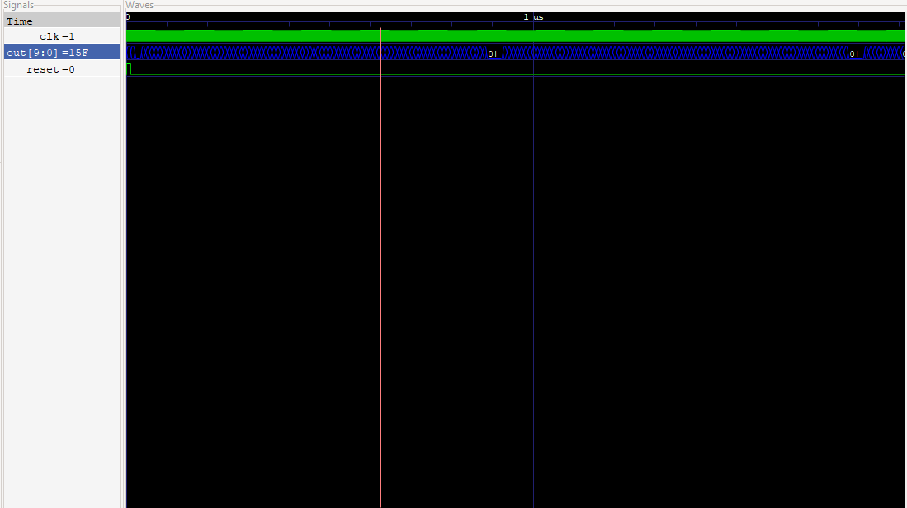

# rvmyth_avsddac_interface

*The purpose of this project is to integrate rvmyth (RISC-V) with digital to analog converter (DAC) and perform PNR using end-to-end open-source EDA tools. It also discusses the steps to modify the current IP layouts inorder to ensure its acceptance by the EDA tools.*

#### Required Tools

`iverilog` and  `gtkwave`

### Problem Statement 
--------------------------


### DAC Specs Provided 
------------------------


First, we will need to generate a verilog module for DAC and obtain the analog output reciprocation for some arbitrary digital inputs to test it. Later we will give the digital output of rvmyth to the 10-bit DAC by creating an interface between the two analog and digital blocks.


## Steps to follow

1. Install `iverilog` and `gtkwave`
2. Simulate rvmyth using the following steps:

     1. `git clone https://github.com/kunalg123/rvmyth/`
     2. `cd rvmyth`
     3. `iverilog mythcore_test.v tb_mythcore_test.v`
     4. `./a.out`
     5. `gtkwave tb_mythcore_test.vcd`
  
 
 

 *10-bit digital codes observed at the output of rvmyth.*
 
 
3. Design the 10-bit DAC using the given specs in verilog and test for its correct functionality.

     1. `iverilog avsddac.v avsddac_tb_test.v`
     2. `./a.out`
     3. `gtkwave avsddac_tb_test.vcd`


**DAC Output in Analog Step format:**


4. Finally integrate both rvymth and DAC using a Top level module and test it to verify the correctness of the integration.


   1. `iverilog rvmyth_avsddac.v rvmyth_TB.v`
   2. `./a.out`
   3. `gtkwave rvmyth_avsddac_interface_TB.vcd`
 


`out [9:0]` --> rvymth 10-bit digital output

`D [9:0]` --> DAC 10-bit digital input 

`Out` --> DAC analog output`


*Further steps require openLANE and skywater130 PDK.*


## OpenLANE and sky130 installation 

* OpenLANE is an automated RTL to GDSII flow based on several components including OpenROAD, Yosys, Magic, Netgen, Fault,SPEF-Extractor and custom methodology scripts for design exploration and optimization.
The OpenLANE and sky130 installation can be done by following the steps in this repository `https://github.com/nickson-jose/openlane_build_script`.

* More information on OpenLANE can be found in this repository `https://github.com/efabless/openlane` .

* After finishing off the installation, the first step in the design flow is to synthesize the generated RTL code. 

### Synthesis in yosys

* In OpenLANE the RTL synthesis is performed by `yosys`.
* The technolgy mapping is performed by `abc`.
* Finally, the timing reports are generated for the resulting synthesized netlist by `OpenSTA`.

Inorder to perform synthesis, you will need:
* Verilog file(.v) of the avsddac and its LIB(.lib) file.
* To generate the LIB file run the perl script given on this [link](https://vlsi.pro/creating-lib-file-from-verilog/), with the command given below. 

`perl verilog_to_lib.pl avsddac.v avsddac`

To perform synthesys in yosys
--> Just type `yosys` in linux shell.
--> Then follow the [script](https://github.com/vsdip/rvmyth_avsddac_interface/blob/main/rvmyth_avsddac.ys) 

The synthesized netlist can be found [here](https://github.com/vsdip/rvmyth_avsddac_interface/blob/main/iverilog/Post-synthesis/rvmyth_avsddac.synth.v). 

--> Now, simulate the generated netlist in `iverilog` & `gtkwave` to compare the pre - synthesis and post- synthesis simulations. 

For that you'd need to create a verilog code for gate level simulation that must include the synthesized netlist verilog file obtained from yosys. The files necessary for pre and post synthesis can be found [here](https://github.com/vsdip/rvmyth_avsddac_interface/tree/main/iverilog).

*Both pre-synth and post-synth simulations must give out the same output.*

**Pre -synthesis Simulation:**


**Post-synthesis Simulation:** 


## OpenSTA
To perform sta in the tool we need to create sdc and config file. Both can be found [here](https://github.com/vsdip/rvmyth_avsddac_interface/tree/main/OpenSTA).

### Timing report
To get the timing report type `sta rvmyth_avsddac.prelayout.conf`


# SoC Physical Design 

Inorder to carry out the physical design flow, following input files are required to get started:

- Top level verilog module : `rvmyth_avsddac.v`
- LIB file : `avsddac.lib`
- LEF file : `avsddac.lef`

## Obtaining IP 

The Digital to Analog Converter (DAC) for sky130 techonology is available in the following repository https://github.com/vsdip/avsddac_3v3_sky130_v1.git, it contains all the magic layout files which will be subsequently required for obtaining the `avsddac.lef` for the 10-bit DAC. 
The magic layout files can be found here ( ). 

Using the magic layout files and the tech file i.e. `sky130A.tech` lef file can be generated after implementing certain modifications to the layout. 


## Obtaining verilog files

The project related verilog files and their respective testbench can be found here (). 


## Generating LEF file

i. Firstly, git clone this repository `https://github.com/vsdip/avsddac_3v3_sky130_v1.git` 

```
git clone https://github.com/vsdip/avsddac_3v3_sky130_v1.git
```

ii.  Then open Magic Tool using the below command: 

```
magic -T `/sky130A.tech ~/10bitdac_cap_layout_design.mag
```

Two windows will open; the layout window and the tckon window. 


In the layout window press 'v' on the keyboard for the full view or go to the option `Window ---> Full view`.


now, using left and right mouse click make a box around the layout:


then, go to : `Cell ---> Expand` to see the complete layout of 10-bit DAC:


Now, using the following command in tckon window dump out the `.lef` file :

```
lef write avsddac.lef
```

## Limitations of current IP Layouts

After opening the lef file ( `avsddac.lef` ) it is observed that there are no pins descriptions available for the design, instead only the labels are present in the layout window. Also certain fields which must be present in the lef file are found missing. Hence, the first task is to convert the labels into pins by carefully modifying the layout. 

These changes must be executed else the LEF file would not be accepted by the PnR tools.


## Resolving the pin issue

Before beginning with the layout modifications, one must be familiar with the following useful shortcut keys in magic: 

  - `s` : To select a particular layer. ( Place the cursor on that layer and type `s` ) 
  - `z` : To zoom in the layout.
  - `Shift+z` : To zoom out the layout.
  - `g` : To enable grid option.
  - Use the arrow keys to navigate across the layout. 

**To convert the labels into ports, select that particular layer where the label is present and then go to the `Edit-->Text`. A text helper window opens up in which specify the following field** :


  - `Text string`: Here give the desirable port name for the selected layer. ( *Make sure that the port names are same as the ones used in the RTL code, else the floorplanning stage would prompt an error* ) 
  - `Size (um)` : This specifies the size of the port name. 
  - `Attach to layer` : Here check the `sticky`, uncheck the `default` and specify the layer. (*here the selected layer is locali*) 
  - `Port` : Check the `enable` option.

`Apply` and `Okay`


To verify if the port is made, in the tckon window: 

```
port name
```


*Similarly repeat the above steps for all the required pins.*


Again dump out the `LEF` file by:

```
lef write avsddac.lef
```

## Other important fields of LEF file

In addition to the making of ports, there are certain other fields which are to be included in the LEF file for it to be accepted by the openlane tool. Use the tckon window to add the following commands:

- ` CLASS CORE ` 
```
 property LEFclass CORE
```

- `DIRECTION`

    - For input pins: 
      ```
      port class input
      ```
      
    - For output pins:
      ```
      port class output
      ```
      
    - For power and ground pins: 
      ```
      port class inout
      ```
      
- `USE` 

    - For power pin:
      ```
      port use power
      ```
      
     - For ground pin:
       ```
       port use ground
       ```
      
     - For other pins:
       ```
       port use signal
       ```


# Physical Design flow in Openlane using sky130 


## Adding a new project

In the `designs` directory, create a folder with the name of the project.

```
cd designs
mkdir rvmyth_avsddac
```

## Setting up the new project

Go to the `~/openlane_working_dir/openlane` and execute the following commands:

```javascript 
export PDK_ROOT=<absolute path to where skywater-pdk and open_pdks reside>
```

```javascript
docker run -it -v $(pwd):/openLANE_flow -v $PDK_ROOT:$PDK_ROOT -e PDK_ROOT=$PDK_ROOT -u $(id -u $USER):$(id -g $USER) openlane:rc6
```

```javascript
 ./flow.tcl -design rvmyth_avsddac -init_design_config
```


This creates a `config.tcl` file with default settings, here the setting of environment variables will be done. This file also contains the reason for some configurations as comments.

The information about the environment variables and their default values can be found here https://github.com/The-OpenROAD-Project/OpenLane/blob/master/configuration/README.md.


## Adding the input files

## Verilog files

The `.v` and `.libs` input files are to added under `~/designs/rvmyth_avsddac/src/verilog` directory. 

  - The top level module is `rvmyth_avsddac.v`.
  - The verilog file of the macro is `avsddac.v`.
  - `mythcore_test.v` , `sp_verilog.vh` , `clk_gate.v` , `mythcore_test_gen.v` , `sandpiper_gen.vh` ,`sandpiper.vh` are the files to be included in the design.


## LEF file

The LEF file `avsddac.v` obtained must be included in `~/designs/rvmyth_avsddac/src/lef` directory.


# The Flow

To harden the macro, the interactive flow in openlane is used: 

Go to the `~/openlane_working_dir/openlane` and execute the following:

```javascript 
export PDK_ROOT=<absolute path to where skywater-pdk and open_pdks reside>
```

```javascript
docker run -it -v $(pwd):/openLANE_flow -v $PDK_ROOT:$PDK_ROOT -e PDK_ROOT=$PDK_ROOT -u $(id -u $USER):$(id -g $USER) openlane:rc6
```

A bash window will open where the interactive flow is executed.

```javascript
 ./flow.tcl -design rvmyth_avsddac -interactive
```

## Setting up the Flow

Execute the following commands: 

```
package require openlane 0.9
```

```
prep -design rvmyth_avsddac -overwrite
```


Adding the LEF file for macro: 
```
set lefs 	 [glob $::env(DESIGN_DIR)/src/lef/*.lef]
```

```
add_lefs -src $lefs
```

## SYNTHESIS

```
run_synthesis
```

The output files can be found here.[]


## FLOORPLANNING

```
init_floorplan
```


## IO Placement


```
place_io
```

## Placement


```
global_placement_or
```

```
detailed_placement
```

```
tap_decap_or
```

```
detailed_placement
```

After final placement, the layout can be viewed in magic using merged LEF and DEF file. The DEF file can be found here.[]

```
magic -T ~/sky130A.tech lef read ~/merged.lef def read rvmyth_avsddac.placement.def
```


