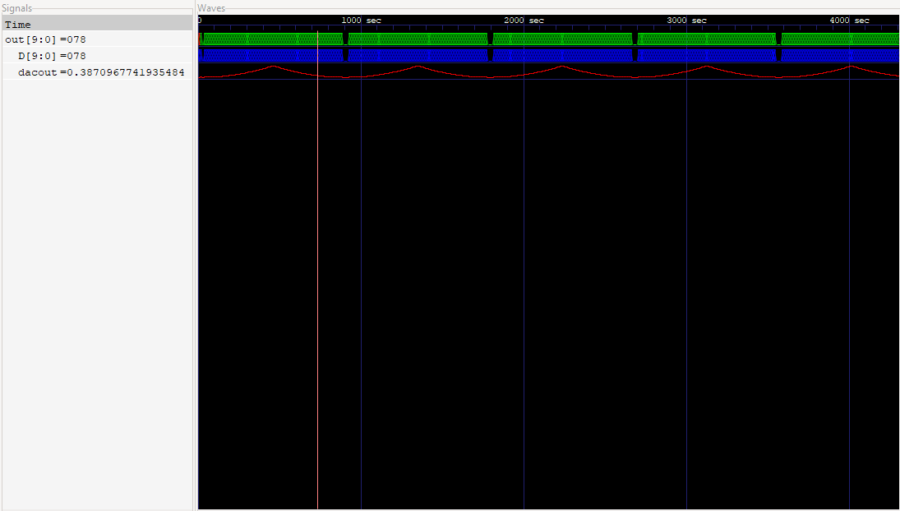

# rvmyth_avsddac_interface

*The purpose of this project is to integrate rvmyth (RISC-V) with digital to analog converter (DAC) using end-to-end open-source EDA tools. To achieve this, firstly we will need to generate a verilog module for DAC and obtain the analog output reciprocation for some arbitrary digital inputs to test it. Later we will give the digital output of rvmyth to the 10-bit DAC by creating an interface between the two analog and digital blocks.*

#### Required Tools

`iverilog` and  `gtkwave`

### Problem Statement 
--------------------------


### DAC Specs Provided 
------------------------


## Steps to follow

1. Install `iverilog` and `gtkwave`
2. Simulate rvmyth using the following steps:

     1. `git clone https://github.com/kunalg123/rvmyth/`
     2. `cd rvmyth`
     3. `iverilog mythcore_test.v tb_mythcore_test.v`
     4. `./a.out`
     5. `gtkwave tb_mythcore_test.vcd`
  
 
 

 *10-bit digital codes observed at the output of rvmyth.*
 
 
3. Design the 10-bit DAC using the given specs in verilog and test for its correct functionality.

     1. `iverilog avsddac.v avsddac_tb_test.v`
     2. `./a.out`
     3. `gtkwave avsddac_tb_test.vcd`


**DAC Output in Analog Step format:**


4. Finally integrate both rvymth and DAC using a Top level module and test it to verify the correctness of the integration.


   1. `iverilog rvmyth_avsddac_interface.v rvmyth_avsddac_interface_TB.v`
   2. `./a.out`
   3. `gtkwave rvmyth_avsddac_interface_TB.vcd`





`out [9:0]` --> rvymth 10-bit digital output

`D [9:0]` --> DAC 10-bit digital input 

`dacout` --> DAC analog output`


*Further steps require openLANE and skywater130 PDK.*


## OpenLANE and sky130 installation 

* OpenLANE is an automated RTL to GDSII flow based on several components including OpenROAD, Yosys, Magic, Netgen, Fault,SPEF-Extractor and custom methodology scripts for design exploration and optimization.
The OpenLANE and sky130 installation can be done by following the steps in this repository `https://github.com/nickson-jose/openlane_build_script`.

* More information on OpenLANE can be found in this repository `https://github.com/efabless/openlane` .

* After finishing off the installation, the first step in the design flow is to synthesize the generated RTL code. 

### `Synthesis`

* In OpenLANE the RTL synthesis is performed by `yosys`.
* The technolgy mapping is performed by `abc`.
* Finally, the timing reports are generated for the resulting synthesized netlist by `OpenSTA`.


--> Inorder to perform synthesis, you will need:
* `.v` of the avsddac and its `.libs` file.
* To generate the `.libs` run the perl script given on this link `https://vlsi.pro/creating-lib-file-from-verilog/`, with the command given below. 

`perl verilog_to_lib.pl avsddac.v avsddac`


--> To open `yosys` , just type `yosys` in linux shell.

--> Then follow the script: 

```
read_verilog rvmyth_avsddac_interface.v 
```

```
read_liberty -lib avsddac.lib
```

```
read_liberty -lib sky130_fd_sc_hd__tt_025C_1v80.lib
```

```
synth -top rvmyth_avsddac_interface
```

```
dfflibmap -liberty sky130_fd_sc_hd__tt_025C_1v80.lib
```

```
opt
```

```
abc -liberty sky130_fd_sc_hd__tt_025C_1v80.lib -script +strash;scorr;ifraig;retime;{D};strash;dch,-f;map,-M,1,{D}
```

```
flatten
```

```
setundef -zero
```

```
clean -purge
```

```
rename -enumerate
```

```
stat
```

```
write_verilog -noattr rvmyth_avsddac.synth.v
```

The synthesized netlist can be found here. 

--> Now, simulate the generated netlist in `iverilog` & `gtkwave` to compare the pre - synthesis and post- synthesis simulations. 

*Both pre-synth and post-synth simulations must give out the same output.*

**Pre -synthesis Simulation:**


**Post-synthesis Simulation:** 


# SoC Physical Design 

Inorder to carry out the physical design flow, following input files are required to get started:

- Top level verilog module : `rvmyth_avsddac.v`
- LIB file : `avsddac.lib`
- LEF file : `avsddac.lef`

## Obtaining IP 

The Digital to Analog Converter (DAC) for sky130 techonology is available in the following repository https://github.com/vsdip/avsddac_3v3_sky130_v1.git, it contains all the magic layout files which will be subsequently required for obtaining the `avsddac.lef` for the 10-bit DAC. 
The magic layout files can be found here ( ). 

Using the magic layout files and the tech file i.e. `sky130A.tech` lef file can be generated after implementing certain modifications to the layout. 


## Obtaining verilog files

The project related verilog files and their respective testbench can be found here (). 


## Generating LEF file

i. Firstly, git clone this repository `https://github.com/vsdip/avsddac_3v3_sky130_v1.git` 

```
git clone https://github.com/vsdip/avsddac_3v3_sky130_v1.git
```

ii.  Then open Magic Tool using the below command: 

```
magic -T `/sky130A.tech ~/10bitdac_cap_layout_design.mag
```

Two windows will open; the layout window and the tckon window. 


In the layout window go to : `Cell --> Expand` to see the complete layout of 10-bit DAC. 


Now, using the following command in tckon window dump out the `.lef` file :

```
lef write avsddac.lef
```

## Limitations of current IP Layouts

After opening the lef file ( `avsddac.lef` ) it is observed that there are no pins descriptions available for the design, instead only the labels are present in the layout window. Also certain fields which must be present in the lef file are found missing. Hence, the first task is to convert the labels into pins by carefully modifying the layout. 

These changes must be executed else the LEF file would not be accepted by the PnR tools.


